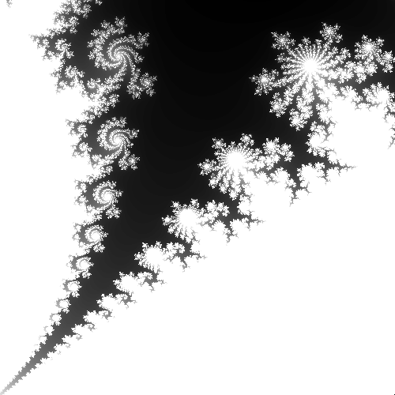
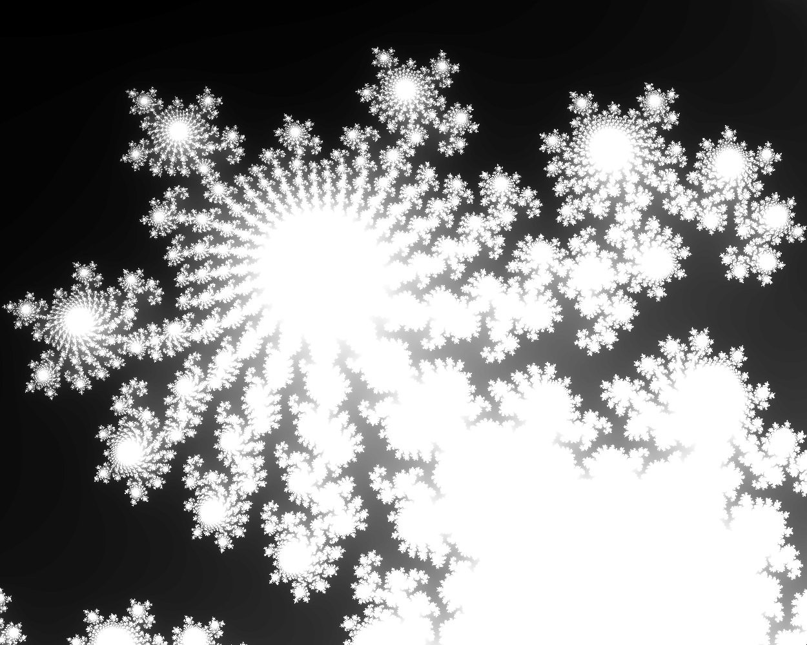
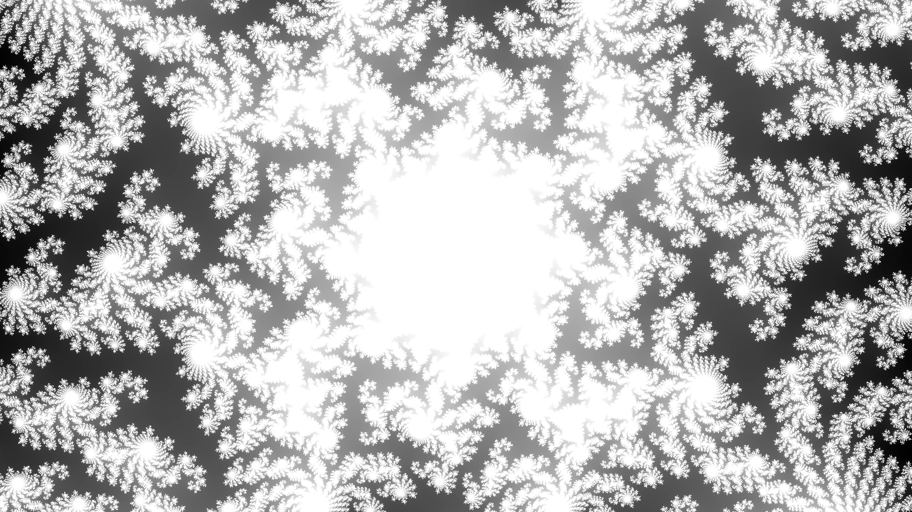

Mandelbrot Set Project
======================
Hello my name is Rex.
Origonally, this project was for a freshman level final project, but I have always wanted to improve it.

## What it does
Prints a PGM image of the mandelbrot set to Mandelbrot_Image.pgm
You can save the image to Mandelbrot_Images file

## Use
Compile using:
 - g++ -std=c++17 -I. main.cpp Code/*.cpp -o mandelbrot  

Run using:
 - ./mandelbrot

## To Do
 - change zoom factor to 2^(x/4) or something similar
 - add filters for more color!
 - redo project to be web based

 ### Optimization
 - reuse values for move
 - reuse values for zoom
 - reuse values for changeImageSize
 - change double to long double or other type
 - do the mandelbrot iterations in parallel

## Original Project
The original program is in the folder "Origonal_Project". This was the project that I completed in school, which I will leave here as inspiration for the next version. The current images are from that project, but hopefully soon I will have the next version working!

## Current Images

## Origonal Images

## Ideas
Create a UI that:
 - Allows click and drag to move around
 - Allows zoom in and out
 - Real time update 
 - Ajustable colors
 - Ajust precission (how many recursions)

 ## GF
 Thanks to my partner Kate for giving me support 💕

